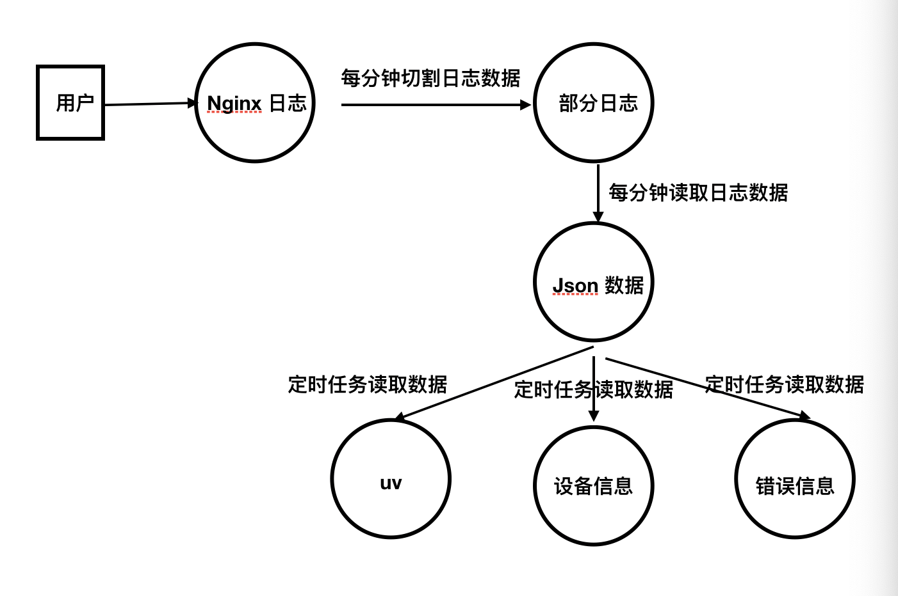

# wall-server
通用模块代码

## 简介：

wall-server 是监控系统的后台管理，单体应用。对[wall-sdk](https://github.com/iSAM2016/wall-sdk) 产生的数据进行收集并，分析数据，统计。

## 技术栈

- nestjs:6.7.2
- mysql:5.7
- redis
- react

运维：

- docker

## 流程图



## 功能点介绍:

- 安全机制（待完成）
- 后台管理（待完成）

- 报警系统,对接到钉钉（完成）
- 时/天/月,统计uv（完成）
- 优化环境变量，区分开发发布环境,添加脚本（完成）
* 解析设备信息（完成）
* 解析用户是否是第一次登陆（完成）
* 解析用户点击行为（完成）
* 解析页面加载性能（完成
* 解析用户停留时间（完成）
* 解析 uv 信息 （完成）
* 添加 logger 日志文件（完成）
* 自动（命令行）建表，形成 sql 语句，分表（完成）
* 每一分钟-定时任务读取 nginx 日志，并格式化存储数据（完成）
* linux-centos 修改为东八区（完成）
* 编写 docker-compose.yml,微服务(完成)
* nginx dockerfile，配置环境变量（完成）
* NGINX 定时任务脚本，每隔一分钟切割日志（完成）
* nginx 基本配置文件，修改东八区，log 日志位置（完成）

## 快速入门

- 克隆项目
  `git clone https://github.com/iSAM2016/wall-server.git`

  `cd wall-server && npm i`

* 设置`env` 环境
  - 请在 `env`目录下设置环境的变量
    -  env_dev.sh 开发环境
    -  env_prod.sh 生产环境

- 开发
  * `npm run dev:env`
  * `npm run dev`

* 生产
  `npm run build`

**对接sdk 的服务端口为 9090**

- 暂时没有后台管理，我们在`wall_t_r_project`，手动插入一个项目，

  - 第一条 `id:1, project_name:NtsGbhvxzDSm1ti2uffSue7u2UIFPVXo`, 其他数据任意

- 设置`sdk`
  配置`wall-sdk`,

```js
import Wall from 'wall_sdk';

Wall.init({
  origin: 'http://ip:9090',
  project_id: 1, //项目的(project_id)
  isTest: false,
});
```

## 开发

## 系统目录介绍

## NGINX 介绍

1. NGINX 日志格式数据为

```
172.21.0.1 - - [2020-02-06T23:21:15+00:00] "GET /?d=%7B%22type%22%3A%22ERROR_SCRIPT%22%2C%22info%22%3A%7B%22message%22%3A%22%E9%9D%99%E6%80%81%E8%B5%84%E6%BA%90%E5%8A%A0%E8%BD%BD%E9%94%99%E8%AF%AF%22%2C%22typeName%22%3A%22script%22%2C%22sourceUrl%22%3A%22https%3A%2F%2Funpkg.com%2Faxios%2Fdist%2Faxios.i.js%22%7D%2C%22options%22%3A%7B%22token%22%3A%229999%22%2C%22origin%22%3A%22http%3A%2F%2Flocalhost%3A9090%22%2C%22isTest%22%3Afalse%2C%22frequency%22%3A1%2C%22userId%22%3A%22wall_KLSkzxldp0fxpyHXOKSuCrMJQoWMoKg2%22%7D%2C%22key%22%3A%22jwQ2ZrE3rOFlOsj19yrIkatrKQBsdRJD%22%2C%22version%22%3A%220.2.2%22%2C%22createTime%22%3A1580905596382%2C%22deviceInfo%22%3A%7B%22deviceName%22%3A%22PC%22%2C%22browserName%22%3A%22chrome%22%2C%22browserVersion%22%3A%2279.0.3945.130%22%2C%22os%22%3A%22web%22%7D%2C%22currentUrl%22%3A%22http%253A%252F%252Flocalhost%253A8001%252F%22%2C%22isUpload%22%3Atrue%7D HTTP/1.1" 200 291 "http://localhost:8001/" "Mozilla/5.0 (Macintosh; Intel Mac OS X 10_14_6) AppleWebKit/537.36 (KHTML, like Gecko) Chrome/79.0.3945.130 Safari/537.36" "-"
```

2.  nginx 日志切割，关键语句

```
kill -USR1 `cat /var/run/nginx.pid`
```

3. 自制 centos 镜像，注册定时任务，切割 NGINX 日志

```
*/1 * * * * sh /home/splitLog.sh
```

## 注意事项

1. 对脚本 .sh 设置 777 权限
2. 编辑执行定时任务文件`davecron`(也可以执行 `crontab -e` 添加任务)
   **注意： davecron 的最后一行是空行**
   内容如下`*/1 * * * * sh /home/splitLog.sh`
   执行： `crontab davecron`

3. docker-compose 常用命令
   - docker-compose up -d 后台执行
   - docker-compose stop
   - docker-compose down
   - docker-compose logs -f nest 查看 nest 日志

### 

统计周期

uv 统计，  小时/天/月


## 目录结构

共享模块（共享mongodb、redis封装服务、通用服务）

核心模块（申明过滤器、管道、拦截器、守卫、中间件、全局模块

特性模块（主要业务模块）

# 创建 orm

`typeorm-model-generator -h 127.0.0.1 -d nest -u root -x abc123456 -e mysql -p 3306 -o .`
